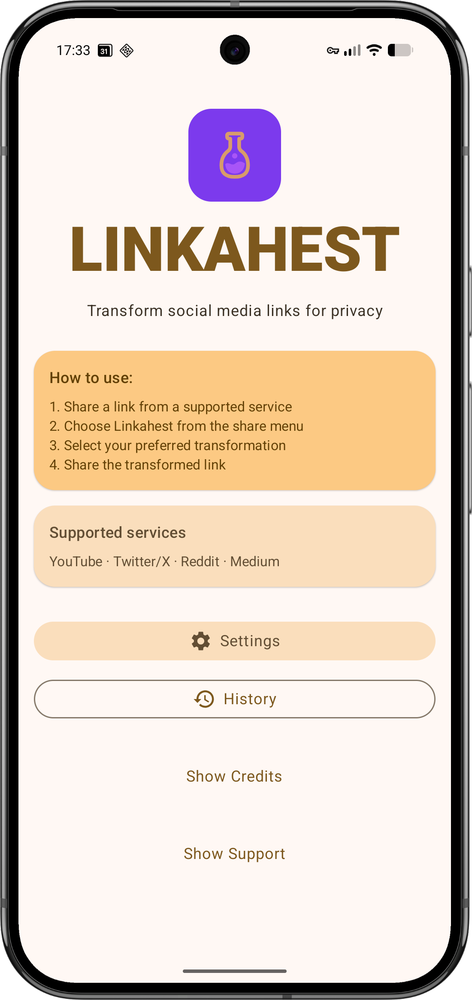
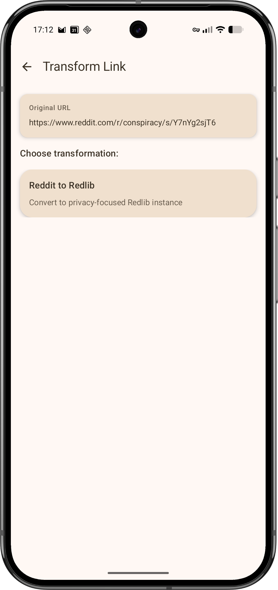
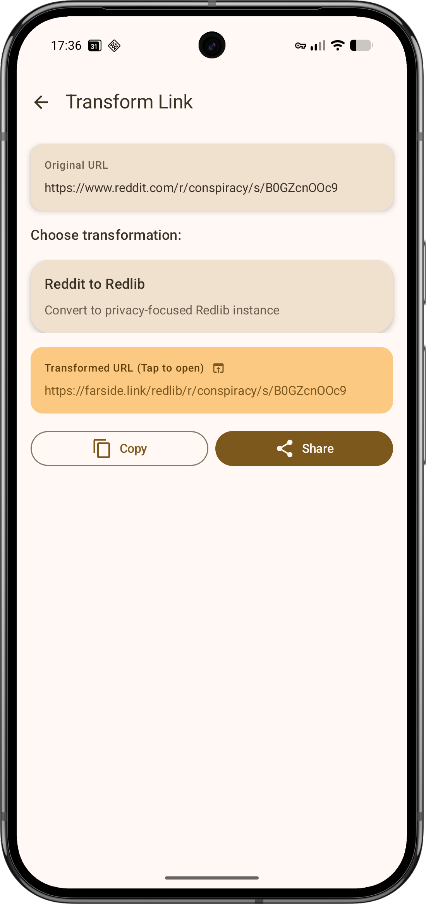
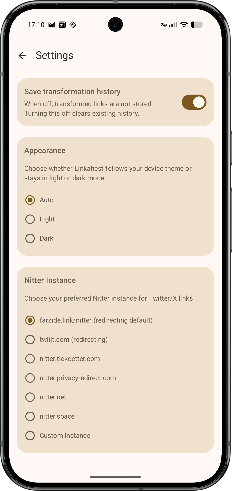

# Linkahest

Linkahest cleans shared links before they leave your phone. Send YouTube, Twitter/X, Reddit, Medium, and other URLs through it to strip trackers or open them through alternative frontends.

It runs locally, requests no network permission, and keeps history off unless you turn it on.

## Features

- Appears in Android's share menu.
- Removes common tracking parameters from shared links.
- Detects redirect links and extracts the real destination when possible.
- Supports alternative frontends for YouTube, Twitter/X, Reddit, and Medium.
- Lets you pick built-in frontend instances or enter your own.
- Keeps transformed-link history disabled by default.
- Supports light, dark, and system themes.

## Additional Screenshots

| Transform Link | Result | Settings |
|:--------------:|:------:|:--------:|
|  |  |  |

## Installation

### Zapstore

Linkahest is available on [Zapstore](https://zapstore.dev/).

### Obtainium or APK

Add the [GitHub releases page](https://github.com/circumspace/linkahest/releases) to Obtainium, or download the APK manually.

## Donate

If Linkahest is useful to you, donations help keep maintenance moving:

**Bitcoin:** `bc1qjt5n267ka8zuagtmrurez9vjs43hlg3qkqc8sc`

**Bitcoin Lightning:** [hermeticvm@minibits.cash](lightning:hermeticvm@minibits.cash)

**Monero:** `8AuPVyudY9hRedjkRzCisrDq5rnzbUvCTckcQr5dUaGWa1yzo77uMUP8LPpSQvPBbGEktHpPqkHFPdXuCYBEL6iz9kXAhFW`
