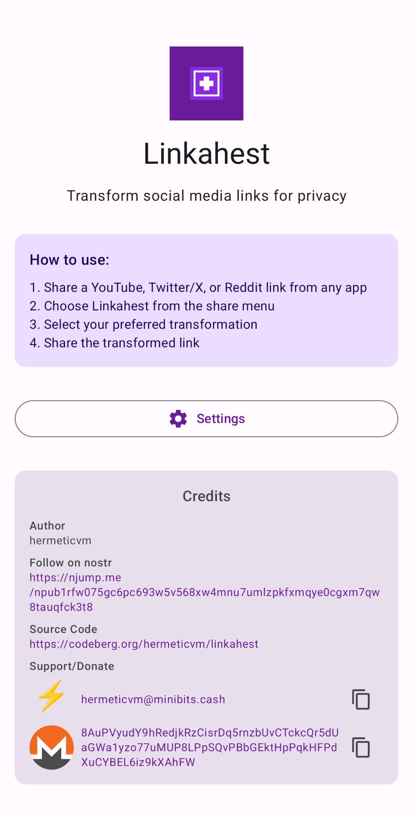
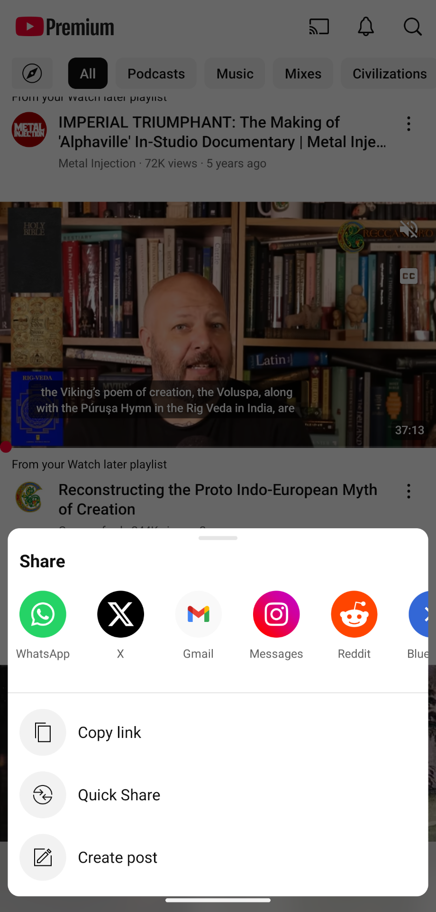
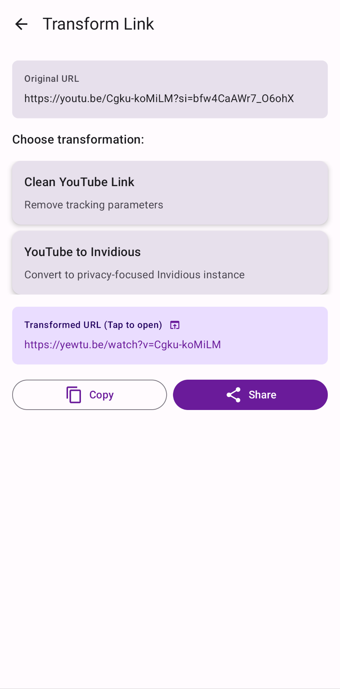
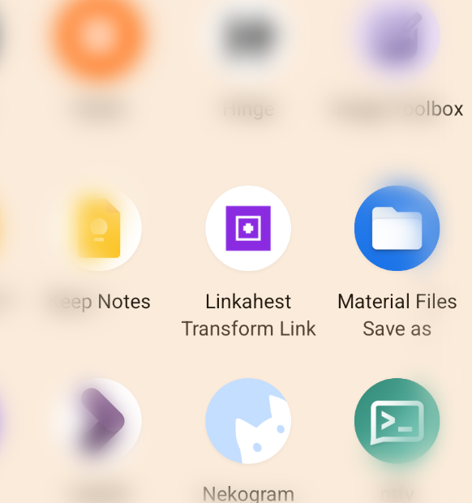
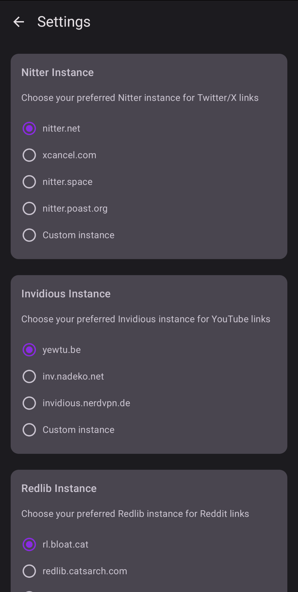

# Linkahest

[](https://www.gnu.org/licenses/gpl-3.0)
[](https://www.android.com)
[](https://kotlinlang.org)

A privacy-focused Android app written in Kotlin that transforms social media links to selfhostable alternative frontends before sharing them. First released under GPL v3 in 2025.

Vibe coded with ~~Goose~~ and Cline.

<div align="center">
  
</div>

## Features

Transform any link to remove tracking parameters and convert social media links to privacy-focused alternatives:

### **Universal Tracking Removal**
- **Remove tracking parameters** from many URLs (UTM codes, social media IDs, analytics, etc.)
- **50+ tracking parameters** automatically detected and removed
- **Cloaked URL detection** - extracts real URLs from redirect services
- **Works on any URL** - not limited to social media

### **Platform Transformations**
- **YouTube**
  - Clean YouTube URLs (remove tracking parameters): `youtube.com/watch?v=ID&si=tracking` → `youtube.com/watch?v=ID`
  - Convert to **Invidious** instances for privacy: `youtube.com/watch?v=ID` → `yewtu.be/watch?v=ID`

- **Twitter/X**
  - Convert to **Nitter** instances: `twitter.com/user/status/ID` → `nitter.net/user/status/ID`

- **Reddit**
  - Convert to **Redlib** instances: `reddit.com/r/subreddit/comments/postID` → `redlib.catsarch.com/r/subreddit/comments/postID`

### **Default Instances**
The app provides curated lists of alternative frontends that you can select from in the settings. Current defaults used when no custom instance is set:

- **Invidious**: `redirect.invidious.io`
- **Nitter**: `twiiit.com`
- **Redlib**: `redlib.catsarch.com`

### **Privacy & Integration**
- **Seamless Integration** - appears in Android share sheet
- **Privacy First** - works completely offline, no data collection
- **Material Design 3 (Material Expressive)** interface with light/dark themes
- **Eink-friendly** - high contrast for eink devices

## Screenshots

| Main Screen | Share from YouTube | Choose Option | Share Transformed | Custom Instances |
|:-----------:|:------------------:|:-------------:|:-----------------:|:----------------:|
|  |  |  |  |  |


## Installation

### Zapstore (Recommended)
Linkahest is available on [Zapstore](https://zapstore.dev/):

Search for "Linkahest" in Zapstore (on Android).

### Obtainium (or direct APK download)
Add [release link](https://github.com/circumspace/linkahest/releases) to Obtainium or install APK manually.

## Quick Start

1. **Install the app** from Zapstore, Obtainium or just download the APK
2. **Share any link** from YouTube, Twitter/X, or Reddit
3. **Select "Linkahest"** from the share menu
4. **Optional:** Pin Linkahest for more frequent use!
5. **Choose transformation** (clean URL, Invidious, Nitter, or Redlib)
6. **Share the transformed link** to other apps
7. **Tap the transformed link** for your own needs without sharing it!

## Building the App

### Prerequisites

- Android Studio
- JDK 21 recommended (or the JDK bundled with current Android Studio)
- Android SDK API 34

### Build Commands

```bash
# Build debug APK
./gradlew assembleDebug

# Install to connected device
./gradlew installDebug

# Build release APK (unsigned)  (**NOTICE**: Release APKs are untested as of yet)
./gradlew assembleRelease
```

## Project Structure

```
app/src/main/java/com/hermeticvm/linkahest/
├── ui/
│   ├── screens/           # Compose screens
│   ├── components/        # Reusable UI components  
│   └── theme/            # Material Design 3 theme
├── data/
│   ├── database/         # Room database components
│   ├── repository/       # Data access layer
│   └── models/          # Data models
├── domain/
│   ├── usecases/        # Business logic
│   └── transformers/    # URL transformation logic
├── MainActivity.kt
└── ShareReceiverActivity.kt
```

## Architecture

- **MVVM** pattern with Repository
- **Jetpack Compose** for UI
- **Room** for local storage
- **Material Design 3** components
- **Kotlin Coroutines** for async operations

## Authors

- **hermeticvm** - Initial work and primary maintainer - [circumspace](https://github.com/circumspace)

## Donate

If you think this app is helpful, consider supporting me. I do not track any usage metrics whatsoever, so every sign of support helps in keeping me motivated to maintain this app. Appreciate it!

**Bitcoin:** `bc1qjt5n267ka8zuagtmrurez9vjs43hlg3qkqc8sc`

**Bitcoin Lightning:** [hermeticvm@minibits.cash](lightning:hermeticvm@minibits.cash)

**Monero:** `8AuPVyudY9hRedjkRzCisrDq5rnzbUvCTckcQr5dUaGWa1yzo77uMUP8LPpSQvPBbGEktHpPqkHFPdXuCYBEL6iz9kXAhFW`

## License

This project is licensed under the GNU General Public License v3.0 - see the [LICENSE](LICENSE) file for details.

## Acknowledgments

- Built with [Jetpack Compose](https://developer.android.com/jetpack/compose)
- Uses [Material Design 3](https://m3.material.io/) components
- I salute all cypherpunks, nostriches and other freedom tech people who keep on inspiring me!
